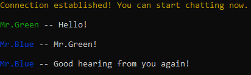

# SecureMessengerCLI

SecureMessengerCLI is a Python-based, end-to-end encrypted command-line chat application. It enables two users to communicate securely over a network using AES-GCM encryption and Diffie-Hellman key exchange. The app supports both client and host modes, uses multithreading for real-time send/receive, and adds colorful terminal UI with colorama.
Features:

* Peer-to-Peer Communication with Host/Client setu

* End-to-End Encryption using AES-GCM

* Diffie-Hellman Key Exchange for secure symmetric key generation

* Multithreaded Messaging allowing simultaneous send and receive

* Color-Coded Terminal Output for improved UX

* No Third-Party Servers — runs fully on local or private networks

Requirements:

Install Python3 onto your system(If you don't have it already).

Install:

1. Clone repository:

         git clone https://github.com/kpuentec/SecureMessengerCLI.git

2. Navigate to the project directory: cd SecureMessengerCLI

3. Install requirements:

         pip install -r requirements.txt

Run:

* Navigate to the root directory, cd SecureMessengerCLI
  
* Run python main.py

* By default, the application connects to HOST = 127.0.0.1 and PORT = 9999. You can modify these to suit your environment by editing the following lines at the top of main.py:

           HOST = "127.0.0.1"
           PORT = 9999

* Ensure both users (Host and Client) have the same HOST and PORT settings before starting the chat.

Structure:

*main.py : Main script handling user interaction and encrypted communication flow, with functions using AES-GCM for secure message transport.

*.gitignore : Git ignore file to exclude unnecessary files

*CLImessage.png : demo image.

*LICENSE : Project license info

*README.md: This file

Output:

* Encrypted chat messages printed live in the terminal
* Clean exit from chat with /quit command
* Terminal display with user-name and color coding for easy readability

**Notes:** 

Changes to the code and other features are susceptible in the future

Application is designed for local or private network use, not hardened for public deployment.

No passwords, usernames, or messages are stored, everything happens in memory during runtime

2025
